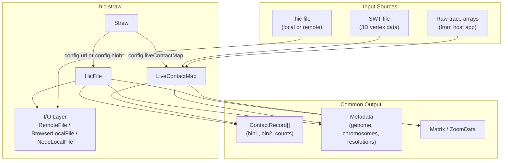
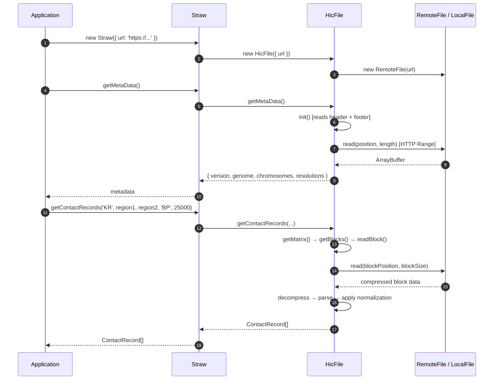
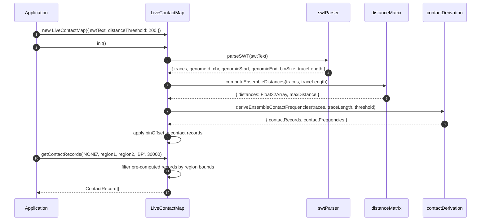
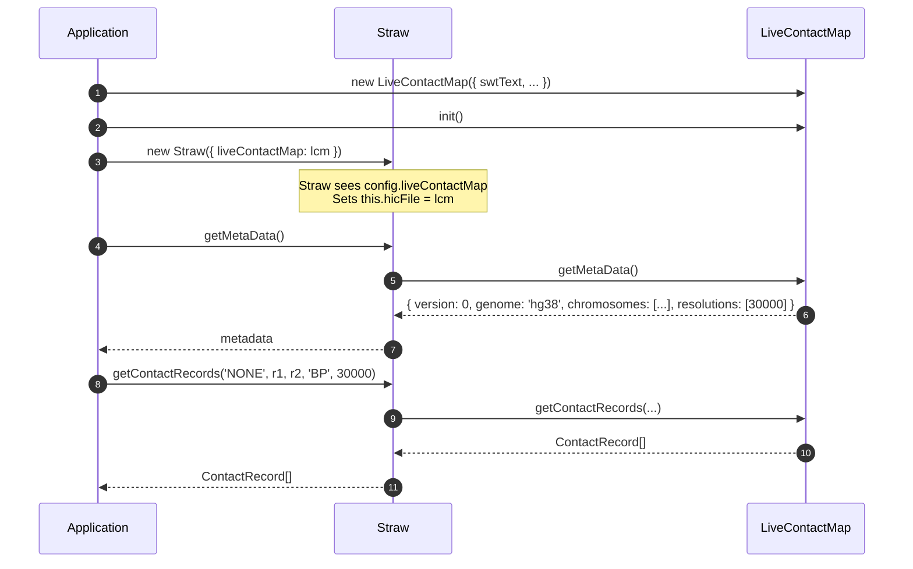
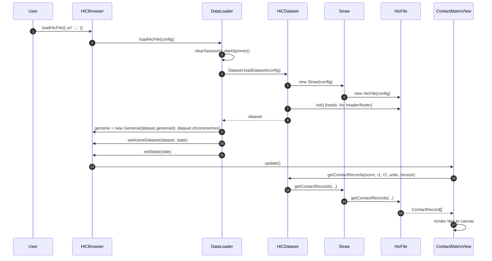
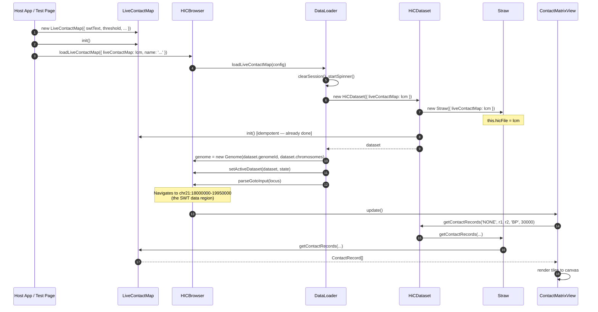
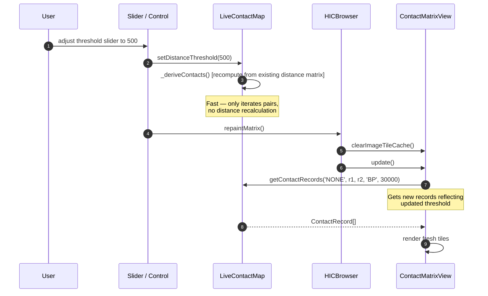
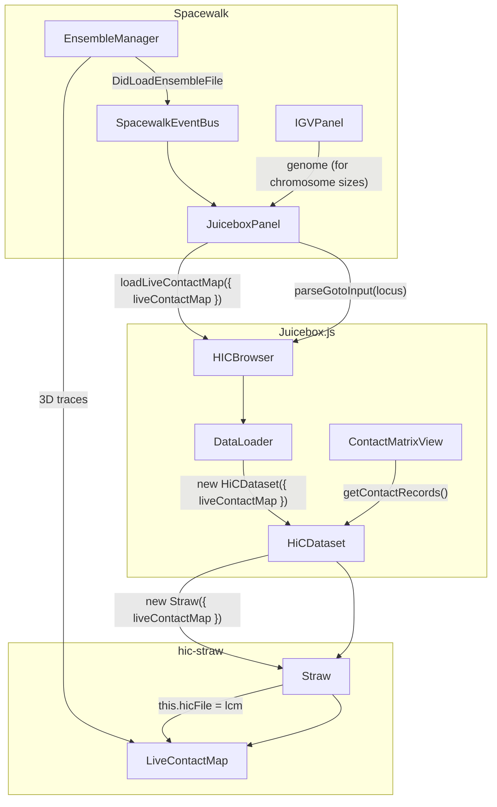
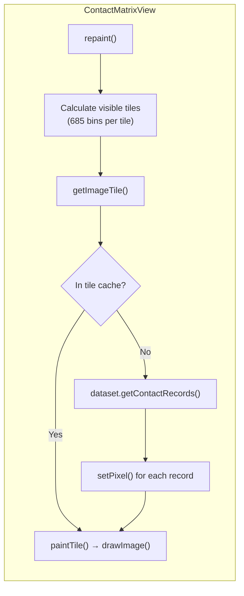

# hic-straw Usage Scenarios & Integration Guide

## Date: 2026-02-17

## Overview

hic-straw has evolved from a single-purpose `.hic` file reader into a Swiss Army knife for contact matrix data. It now serves two fundamentally different data sources through a unified interface:

1. **Traditional mode** — read pre-computed contact matrices from `.hic` files (Hi-C experimental data)
2. **Live mode** — compute contact matrices on the fly from 3D chromosome structure data (SWT files)

Both modes produce identical output: arrays of `ContactRecord(bin1, bin2, counts)`. Downstream consumers — Juicebox.js, custom analysis scripts, CLI tools — cannot distinguish between the two.

---

## Architecture



### The HicFile Interface

Both `HicFile` and `LiveContactMap` implement the same interface. This is the contract that `Straw` depends on:

| Method | HicFile | LiveContactMap |
|--------|---------|----------------|
| `init()` | Reads header, footer, master index from `.hic` binary | Parses SWT, computes distance matrix, derives contacts |
| `getMetaData()` | Returns version, genome, chromosomes, resolutions from file header | Returns synthetic metadata (version=0, single resolution) |
| `getContactRecords(norm, r1, r2, units, binsize)` | Reads compressed blocks, applies normalization vectors | Filters pre-computed in-memory contact records |
| `getMatrix(chr1, chr2)` | Returns multi-resolution Matrix with block index | Returns single-resolution LiveMatrix |
| `hasNormalizationVector(...)` | Checks normalization vector index | Always returns `false` |
| `getNormalizationOptions()` | Returns available types (NONE, VC, VC_SQRT, KR) | Always returns `['NONE']` |
| `getFileChrName(alias)` | Resolves via chrAliasTable from file header | Resolves via locally built alias table |

### The Straw Router

Straw's constructor is the routing point. It inspects the config and chooses the appropriate backend:

```javascript
class Straw {
    constructor(config) {
        if (config.liveContactMap) {
            this.hicFile = config.liveContactMap  // LiveContactMap IS the hicFile
        } else {
            this.hicFile = new HicFile(config)    // Traditional .hic file reader
        }
    }
}
```

After construction, all Straw methods delegate to `this.hicFile` — the caller never needs to know which backend is in use.

---

## Scenario 1: Standalone `.hic` File Reading

The original and most common use case. A consumer provides a URL, local file path, or browser Blob to read a `.hic` file.

### Data Flow



### Usage Examples

**Node.js (local file):**
```javascript
import Straw from 'hic-straw'
import NodeLocalFile from 'hic-straw/src/io/nodeLocalFile.mjs'

const straw = new Straw({ file: new NodeLocalFile({ path: 'data.hic' }) })
const meta = await straw.getMetaData()
const records = await straw.getContactRecords(
    'KR',
    { chr: 'chr21', start: 28000000, end: 30000000 },
    { chr: 'chr21', start: 28000000, end: 30000000 },
    'BP', 25000
)
```

**Browser (remote URL):**
```javascript
import Straw from 'hic-straw'

const straw = new Straw({
    url: 'https://hicfiles.s3.amazonaws.com/hiseq/gm12878/in-situ/combined.hic'
})
const records = await straw.getContactRecords('VC_SQRT', region1, region2, 'BP', 50000)
```

**Browser (local file via drag-drop or file picker):**
```javascript
const straw = new Straw({ blob: fileInputElement.files[0] })
```

### Key Characteristics

- **Multi-resolution:** `.hic` files contain data at many resolutions (e.g., 2.5M, 1M, 500K, 250K, 100K, 50K, 25K, 10K, 5K)
- **Multi-chromosome:** All chromosome pairs available
- **Normalization:** Supports VC, VC_SQRT, KR, and custom normalization vectors
- **Lazy I/O:** Data is read on demand via HTTP Range requests or random file access
- **Caching:** LRU caches for matrices (10), blocks (6), and normalization vectors (10)

---

## Scenario 2: Standalone LiveContactMap (No Visualization)

Use hic-straw to compute a synthetic contact map from 3D structure data, without any visualization framework. Useful for analysis scripts, data processing pipelines, or testing.

### Data Flow



### Usage

```javascript
import { LiveContactMap } from 'hic-straw'
import fs from 'fs'

const swtText = fs.readFileSync('ball-and-stick.swt', 'utf-8')
const lcm = new LiveContactMap({
    swtText,
    distanceThreshold: 200,
    neighborExclusion: 3,
    contactMode: 'frequency'
})
await lcm.init()

// Query like any Straw data source
const records = await lcm.getContactRecords(
    'NONE',
    { chr: 'chr21', start: 28000000, end: 30000000 },
    { chr: 'chr21', start: 28000000, end: 30000000 },
    'BP', 30000
)

// Access raw computation results
const { distances, maxDistance } = lcm.getDistanceMatrix()
const frequencies = lcm.getContactFrequencies()

// Adjust parameters without recomputing distances
lcm.setDistanceThreshold(500)
lcm.setNeighborExclusion(5)
```

### Key Characteristics

- **Single resolution:** One bin size determined by SWT data (typically 30 kb)
- **Single chromosome:** SWT data covers one chromosome region
- **No normalization:** Only `NONE` is supported
- **In-memory:** All computation happens in memory, no file I/O after initial parse
- **Dynamic parameters:** Distance threshold and neighbor exclusion can be changed cheaply (recomputes contacts but not distances)
- **Expensive initialization:** Distance matrix computation is O(N^2 * T) where N = bins, T = traces

---

## Scenario 3: LiveContactMap via Straw (Unified Interface)

Route LiveContactMap through Straw for code that expects the Straw API. The caller doesn't need to know whether the data comes from a file or from 3D structures.

### Data Flow



### Usage

```javascript
import Straw, { LiveContactMap } from 'hic-straw'

const lcm = new LiveContactMap({ swtText, distanceThreshold: 200 })
await lcm.init()

// From here on, same API as a .hic file
const straw = new Straw({ liveContactMap: lcm })
const meta = await straw.getMetaData()
const records = await straw.getContactRecords('NONE', region1, region2, 'BP', 30000)
```

---

## Scenario 4: Juicebox.js Integration — Loading a `.hic` File

The standard Juicebox.js workflow. The browser loads a `.hic` file, creating a `HiCDataset` that wraps `Straw` which wraps `HicFile`.

### Data Flow



### Key Points

| Aspect | Detail |
|--------|--------|
| **Entry point** | `browser.loadHicFile({ url, name, locus })` |
| **Dataset type** | `HiCDataset extends Dataset` |
| **Genome source** | Extracted from `.hic` file header |
| **State** | Supports all zoom levels, all chromosome pairs |
| **Normalization** | Full support (VC, VC_SQRT, KR, etc.) |

---

## Scenario 5: Juicebox.js Integration — Loading a LiveContactMap

The new integration pathway. A host application creates a `LiveContactMap`, then loads it into Juicebox using the same `HiCDataset → Straw` pipeline that `.hic` files use.

### Data Flow



### Key Points

| Aspect | Detail |
|--------|--------|
| **Entry point** | `browser.loadLiveContactMap({ liveContactMap, name, locus })` |
| **Dataset type** | `HiCDataset extends Dataset` (same as `.hic` files) |
| **Genome source** | Extracted from SWT header (`genomeId`) + `knownChromosomeSizes` lookup for real chromosome sizes |
| **State** | Single zoom level, single chromosome, NONE normalization |
| **Locus navigation** | Automatically navigates to SWT data region via `parseGotoInput()` |

---

## Scenario 6: Dynamic Parameter Updates (Juicebox.js)

After a LiveContactMap is loaded in Juicebox, the user can adjust the distance threshold or neighbor exclusion. These changes recompute contacts cheaply (no distance matrix recomputation) and invalidate the tile cache.

### Data Flow



### Key Points

| Aspect | Detail |
|--------|--------|
| **Threshold change** | `lcm.setDistanceThreshold(value)` — recomputes contacts, not distances |
| **Neighbor exclusion change** | `lcm.setNeighborExclusion(value)` — recomputes contacts, not distances |
| **Cache invalidation** | `browser.repaintMatrix()` clears the image tile cache |
| **Performance** | Contact derivation is O(N^2 * T); distance computation is O(N^2 * T * 3). Skipping distances saves ~3x |

---

## Scenario 7: Spacewalk Integration (Future)

Spacewalk embeds Juicebox.js as a panel. It loads 3D chromosome structure data (SWT/ensemble files) and uses LiveContactMap to display synthetic contact maps alongside the 3D visualization. This is the ultimate integration target.

### Architecture



### Spacewalk-Specific Constraints

In Spacewalk, Juicebox operates under constraints that differ from standalone use:

| Constraint | Standalone Juicebox | Spacewalk Context |
|------------|--------------------|--------------------|
| **Panning** | Free pan across genome | No panning — single fixed locus |
| **Zooming** | Multi-resolution zoom | No zooming — single resolution |
| **Locus** | User navigates freely | Spacewalk's ensemble locus is the single source of truth |
| **Normalization** | VC, VC_SQRT, KR, etc. | NONE only |
| **Chromosome pairs** | Any pair | Single intra-chromosomal view |
| **Genome source** | From `.hic` file | From IGV's genome (via Spacewalk) |
| **Locus direction** | Bidirectional | Uni-directional: Spacewalk → Juicebox only |

### Genome Synchronization

A key architectural detail: In Spacewalk, the genome can come from two different sources depending on map type.

**For `.hic` maps:** Juicebox extracts the genome from the `.hic` file header. This genome may differ from IGV's genome (e.g., `.hic` file is hg19 while ensemble uses hg38). Spacewalk's locus is applied regardless.

**For live maps:** The genome comes from the SWT data (via LiveContactMap), which matches the ensemble genome in IGV. The `knownChromosomeSizes` lookup ensures full chromosome sizes are correct for Juicebox widget positioning.

---

## Technical Deep Dive: The Bin Offset

A critical detail for LiveContactMap compatibility with the Juicebox rendering pipeline.

### The Problem

In a `.hic` file, bin indices are **absolute** — they represent `genomicPosition / binSize` relative to the start of the chromosome. Juicebox's rendering pipeline (specifically `ContactMatrixView.getImageTile()`) queries by genomic coordinate, converts to bin indices, and expects records with matching absolute bin indices.

In an SWT file, trace vertex indices are **relative** — they run from 0 to N-1 where N is the number of bins in the trace. An SWT file covering chr21:18000000-19950000 at 30 kb resolution has vertices 0..64, but Juicebox expects bin indices 600..664 (because 18000000 / 30000 = 600).

### The Solution

LiveContactMap computes a `binOffset` during initialization:

```
binOffset = Math.floor(genomicStart / binSize)
```

After deriving contact records from the distance matrix (which uses trace-relative indices 0..N-1), the offset is applied:

```javascript
this.contactRecords = rawRecords.map(rec =>
    new ContactRecord(rec.bin1 + offset, rec.bin2 + offset, rec.counts)
)
```

This ensures that when Juicebox queries for records in the region `chr21:28000000-30000000`, the bin indices match.

---

## Technical Deep Dive: Chromosome Size & Widget Positioning

### The Problem

SWT data covers a sub-region of a chromosome (e.g., chr21:18000000-19950000). If `chromosome.size` is set to the data extent (~19.9 Mb), Juicebox's scrollbar widget calculates incorrect label positions because it uses chromosome size for percentage-based positioning:

```
position% = (state.x / chromosomeLengthsBin) * 100%
where chromosomeLengthsBin = chromosome.size / binSize
```

With `chromosome.size = 19950000` instead of `46709983` (real chr21 size), the scrollbar labels appear at the wrong location.

### The Solution

LiveContactMap includes a `knownChromosomeSizes` lookup table for hg38 and hg19:

```javascript
const knownChromosomeSizes = {
    hg38: { chr1: 248956422, chr2: 242193529, ..., chr21: 46709983, ... },
    hg19: { chr1: 249250621, chr2: 243199373, ..., chr21: 48129895, ... }
}
```

During `init()`, the real chromosome size is looked up:

```javascript
const genomeSizes = knownChromosomeSizes[genomeId]
if (genomeSizes && genomeSizes[chr]) {
    chrSize = genomeSizes[chr]
} else {
    chrSize = genomicEnd  // Fallback for unknown genomes
}
```

This ensures scrollbar labels, rulers, and coordinate clamping all work correctly, matching the behavior of a real `.hic` file for the same chromosome.

---

## The Rendering Pipeline (Juicebox.js)

Understanding how contact records become pixels. This pipeline is shared by both `.hic` files and LiveContactMap.



### Tile Dimensions

The rendering pipeline divides the contact matrix into tiles of **685 x 685 bins** (`imageTileDimension`). For a typical SWT file:

| Data Size | Tiles | Notes |
|-----------|-------|-------|
| 65 bins (small SWT) | 1 tile | Entire matrix fits in one tile |
| 685 bins | 1 tile | Exactly fills one tile |
| 1370 bins | 4 tiles (2x2) | Moderate SWT spanning ~41 Mb at 30 kb |
| Full chromosome | Many tiles | Large SWT, renders like a sparse Hi-C map |

### Pixel Size

`pixelSize` determines how many screen pixels each bin occupies. It's clamped between 1 and 128:

```
minPixelSize = viewport_width / nBins
```

For a 65-bin SWT in a 600px viewport: `pixelSize = 600/65 ≈ 9.2` — each bin is ~9 pixels wide. For a full-chromosome SWT at 30 kb: `pixelSize = 1` — many bins are off-screen.

---

## Contact Derivation Modes

LiveContactMap supports two modes for converting 3D distances to contact records:

### Frequency Mode (`contactMode: 'frequency'`)

Each trace is evaluated independently. For each pair (i, j), count how many traces show distance < threshold, divide by total valid traces.

```
frequency(i, j) = (traces where distance(i,j) < threshold) / (valid traces for pair)
```

**Output:** `counts` values range from 0.0 to 1.0 (fraction of traces in contact). This is the default mode and produces the most informative contact maps.

### Contact Mode (`contactMode: 'contact'`)

Uses the ensemble-averaged distance matrix. For each pair, if average distance < threshold, record a binary contact.

```
contact(i, j) = 1 if avg_distance(i,j) < threshold, else 0
```

**Output:** `counts` values are 0 or 1. Simpler but less nuanced.

### Neighbor Exclusion

Both modes support `neighborExclusion` — skip pairs where `|i - j| <= k`. This suppresses the trivially bright diagonal caused by sequential polymer connectivity, highlighting biologically meaningful long-range contacts. See [neighbor-exclusion.md](./neighbor-exclusion.md) for the design discussion.

---

## File Format Reference

### SWT (Spacewalk Text) — Ball & Stick

```
##format=sw1 name=IMR90 genome=hg38
chromosome  start   end     x       y       z
trace 0
chr21       18000000 18030000 117803  58446  1733
chr21       18030000 18060000 117726  58747  1680
...
trace 1
chr21       18000000 18030000 ...
...
```

- **Header:** `##format=sw1` with `name` and `genome` metadata
- **Traces:** Multiple independent 3D conformations of the same region
- **Bins:** Contiguous genomic bins (e.g., 30 kb) with XYZ coordinates
- **Parser:** `swtParser.js` in hic-straw

### .hic (Hi-C Contact Matrix)

Binary format with header, compressed contact blocks, and normalization vectors. Versions 5-9 supported. See the [Aiden Lab documentation](https://github.com/aidenlab/straw/wiki) for format details.

---

## Source Files Reference

### hic-straw (`src/`)

| File | Role |
|------|------|
| `index.js` | Exports: `Straw` (default), `LiveContactMap` (named) |
| `straw.js` | Thin router — delegates to HicFile or LiveContactMap |
| `hicFile.js` | `.hic` file parser (~1000 lines) |
| `liveContactMap.js` | In-memory adapter implementing HicFile interface |
| `swtParser.js` | SWT text format parser |
| `contactRecord.js` | `ContactRecord(bin1, bin2, counts)` data class |
| `distanceMatrix.js` | Pairwise Euclidean distance computation (single trace & ensemble) |
| `contactDerivation.js` | Threshold-based contact record generation |
| `matrix.js` | Multi-resolution matrix container |
| `matrixZoomData.js` | Single resolution level metadata |
| `normalizationVector.js` | Lazy-loaded normalization vectors |
| `binary.js` | Binary data reader (DataView wrapper) |
| `lru.js` | LRU cache (used by HicFile for matrices, blocks, norm vectors) |
| `io/remoteFile.js` | HTTP Range request file access |
| `io/bufferedFile.js` | Read-ahead buffering wrapper |
| `io/browserLocalFile.js` | Browser Blob/File access |
| `io/nodeLocalFile.mjs` | Node.js file system access |

### Juicebox.js Integration Points (`js/`)

| File | Role |
|------|------|
| `hicBrowser.js` | `loadLiveContactMap()` — public API entry point |
| `dataLoader.js` | `loadLiveContactMap()` — orchestrates loading pipeline |
| `hicDataset.js` | `HiCDataset` — wraps Straw, delegates contact record fetching |
| `contactMatrixView.js` | Tile-based rendering — calls `dataset.getContactRecords()` |
| `hicState.js` | State management — position, zoom, normalization |
| `scrollbarWidget.js` | Chromosome label positioning (uses `chromosome.size`) |
| `genome.js` | Genome metadata and chromosome name aliasing |

---

## Related Documents

- [3D to Contact Map Strategy](./3d-to-contact-map-strategy.md) — original design discussion
- [Neighbor Exclusion](./neighbor-exclusion.md) — diagonal suppression design discussion
